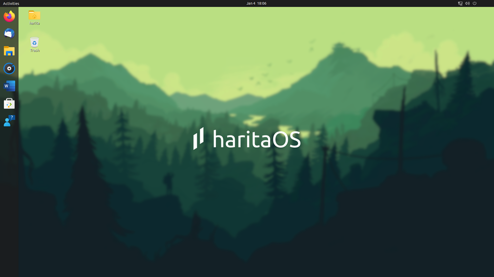
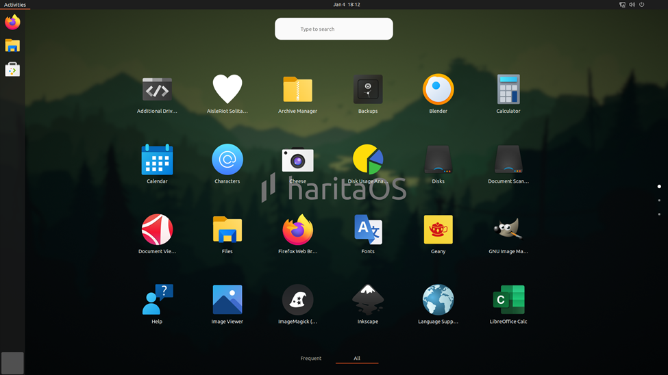
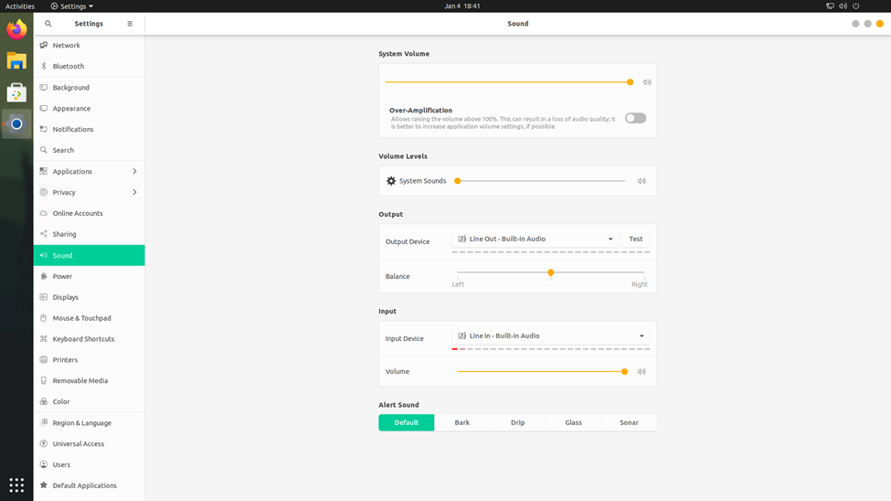

# HaritaOS

🌱 **Ubuntu 20.04 remaster dengan tema hijau yang terinspirasi alam Indonesia**



## Overview

HaritaOS adalah distribusi Linux berbasis Ubuntu 20.04 LTS yang dirancang khusus dengan tema hijau yang terinspirasi dari keindahan alam Indonesia. Dilengkapi dengan icon pack kustom, tema yang elegan, dan aplikasi bawaan yang berguna.

## Features

- 🎨 **Tema Hijau Kustomisasi** - Desain yang terinspirasi alam Indonesia
- 🖼️ **Icon Pack Beragam** - Multiple icon themes termasuk HaritaIcons
- 🚀 **Boot Splash Kustom** - Plymouth theme dengan branding HaritaOS
- 🏠 **Welcome App** - Aplikasi selamat datang untuk first-run experience
- 🛠️ **Settings Tool** - Tool konfigurasi sistem yang mudah digunakan
- 🌏 **Lokalisasi Indonesia** - Dukungan Bahasa Indonesia

## Quick Start

```bash
# Clone repository
git clone https://github.com/hussainabdillah/remastering-harita-os.git
cd remastering-harita-os

# Download Ubuntu 20.04 ISO
wget http://releases.ubuntu.com/20.04/ubuntu-20.04.6-desktop-amd64.iso

# Build HaritaOS (Linux required)
chmod +x build.sh
sudo ./build.sh
```

## Requirements for Building

**Note: Building HaritaOS requires a Linux environment (Ubuntu/Debian recommended)**

For Windows users:
- Use WSL2 (Windows Subsystem for Linux)
- Use VirtualBox/VMware with Ubuntu
- Use Docker with Ubuntu container

### System Requirements
- Ubuntu/Debian-based system
- Minimum 4GB RAM
- 20GB free disk space
- Internet connection

### Dependencies

```bash
sudo apt install squashfs-tools genisoimage syslinux-utils
```

## Development on Windows

### Option 1: WSL2 (Recommended)
```powershell
# Install WSL2
wsl --install -d Ubuntu-20.04

# Open WSL and follow Linux build instructions
wsl
```

### Option 2: Docker
```powershell
# Pull Ubuntu container
docker pull ubuntu:20.04

# Run container with repository mounted
docker run -it -v C:\Users\Admin\Documents\Project\Remastering\HaritaOS:/workspace ubuntu:20.04 bash
```

## Documentation

- [Build Guide](docs/BUILDING.md)
- [Windows Development Setup](docs/WINDOWS-SETUP.md)
- [Customization Guide](docs/CUSTOMIZATION.md)
- [Contributing](docs/CONTRIBUTING.md)

## Screenshots

| Desktop | Applications | Settings |
|---------|-------------|----------|
|  |  |  |

## Support

- 🐞 [Report Issues](https://github.com/hussainabdillah/remastering-harita-os/issues)
- 💬 [Discussions](https://github.com/hussainabdillah/remastering-harita-os/discussions)
- 📧 Email: support@haritaos.org

## License

GPL-3.0 License - see [LICENSE](LICENSE) for details.

---
Made with ❤️ in Indonesia
